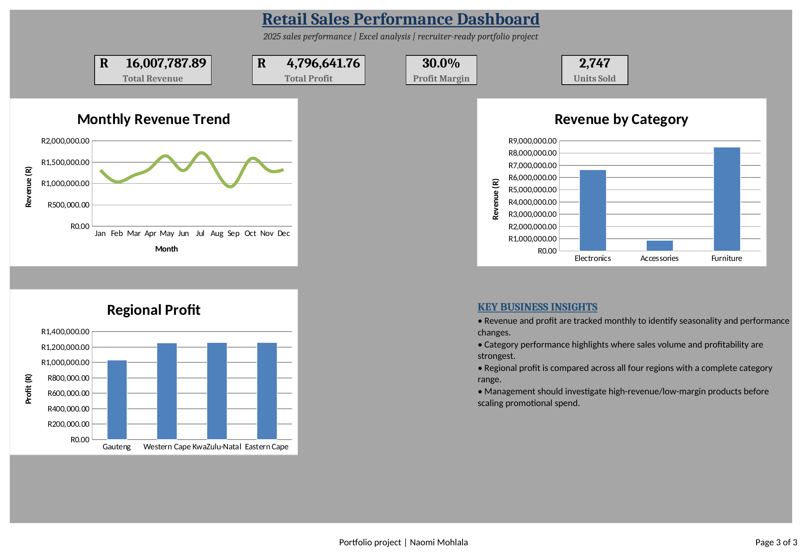

# Retail Sales Performance Analysis

## What I was trying to find out
Where is this business actually making money, and where is it losing ground — by month, by category, and by region.

## The data
600 transactions across three categories (Electronics, Furniture, Accessories) and four South African regions.

## How I built it
Nothing on the dashboard is a typed-in number. The Analysis sheet pulls everything from the raw data with `SUMIF`, so if the raw data changes, every chart and KPI updates on its own. There's also a native PivotTable for anyone who wants to dig in beyond the fixed dashboard views.

## What I found
Total revenue came out to **R16,007,787.89**, with a **30% profit margin**. Furniture was the surprise — it's the top revenue category at R8.48M, ahead of Electronics at R6.65M, even though I'd have guessed Electronics would win on higher unit volume. Accessories trailed well behind both at under R1M.

Regionally, three of the four provinces landed within a tight band of each other on profit (R1.2–1.25M). Gauteng didn't — it came in noticeably lower at ~R1.03M despite being the largest market. That's the kind of thing that looks small in a table but is actually the most important line in the whole analysis, because it's not explained by anything else in the data. Someone needs to go find out why.

## What I'd do next
Look into Gauteng specifically — is it a volume problem or a margin problem? And take a second look at Accessories: is it genuinely low demand, or just under-marketed compared to the other two categories?

## Files
- `Retail_Sales_Performance_Analysis.xlsx` — Raw Data, Analysis, Dashboard, PivotTable
- `screenshots/retail_dashboard.png`

## Tools
Excel — SUMIF, live-formula Analysis layer, PivotTables, native charts
