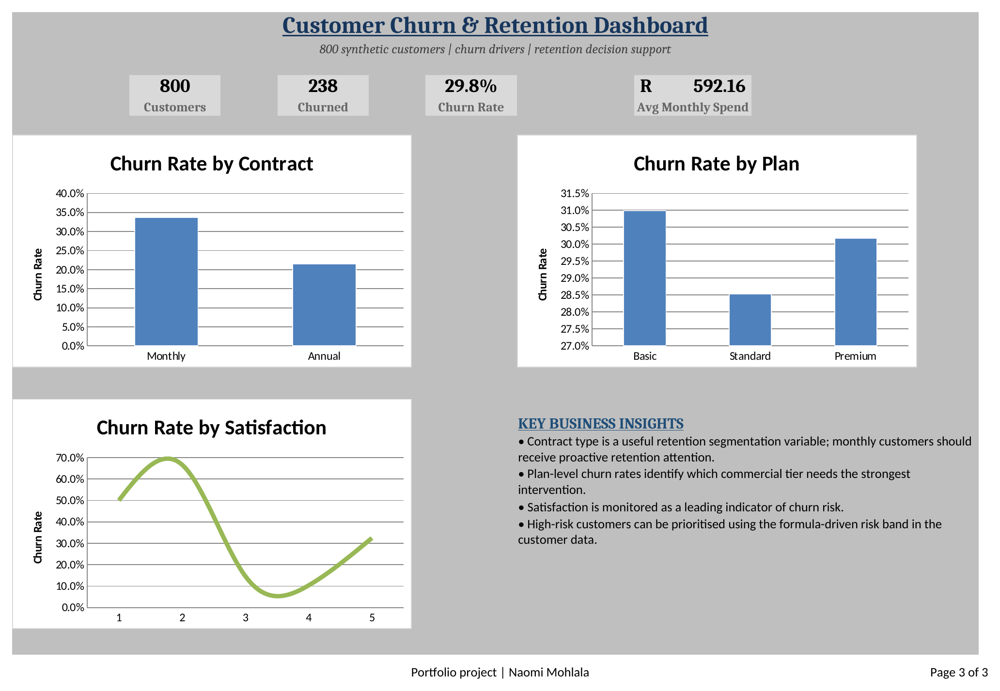

# Customer Churn & Retention Analysis

## What I was trying to find out
Which customers are actually at risk of leaving, and does the business have a real lever to pull — or is churn just random noise?

## The data
800 customers, tagged by contract type (Monthly/Annual), plan tier (Basic/Standard/Premium), and a 1–5 satisfaction score.

## How I built it
The Analysis sheet uses `COUNTIFS` and `AVERAGEIFS` to segment churn by contract, plan, and satisfaction — live, not hardcoded. The dashboard also has PivotTable slicers so you can filter interactively instead of only seeing my fixed view of it.

## What I found
238 of 800 customers churned — a **29.8% overall rate**. The clearest pattern: **Monthly contract customers churn at 33.6%, versus 21.5% for Annual customers.** That's not a small gap — it's the strongest single signal in the whole dataset.

Plan tier, on the other hand, barely mattered. Basic, Standard, and Premium all sat within a few points of each other, which told me plan tier isn't a useful thing to target retention campaigns around.

Satisfaction score was the most interesting part. Churn was highest at the lowest satisfaction score, dropped sharply through the middle, and then ticked back *up* slightly at the very top score. That's not the clean straight line I expected, and it's worth someone checking whether those "5-star but still churned" customers are short-term or trial users who were never going to stay regardless of experience.

## What I'd do next
Put retention budget behind converting Monthly customers to Annual contracts first — it's the highest-leverage move in the data. And dig into that top-satisfaction-score churn bump before assuming satisfaction alone predicts loyalty.

## Files
- `Customer_Churn_Retention_Analysis.xlsx` — Customer Data, Analysis, Dashboard, PivotTable
- `screenshots/churn_dashboard.png`

## Tools
Excel — COUNTIFS, AVERAGEIFS, PivotTables with slicers, native charts
