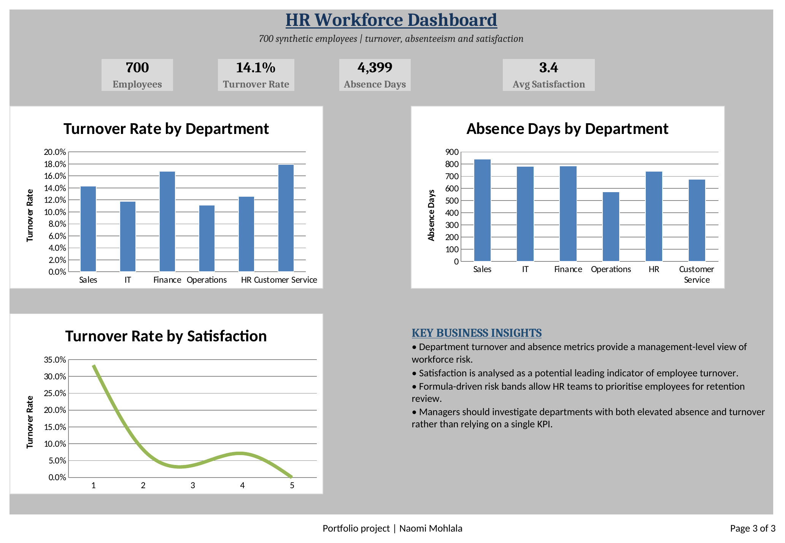

# HR Workforce Analysis

## What I was trying to find out
Which departments are actually struggling with people leaving or not showing up — and whether satisfaction scores can predict it.

## The data
700 employees across six departments, with salary, tenure, satisfaction (1–5), absence days, and whether they left.

## How I built it
Same approach as the other two — `COUNTIFS`, `AVERAGEIFS`, and `SUMIFS` doing the actual segmentation work on the Analysis sheet, feeding a dashboard that updates itself, plus a PivotTable for anyone who wants to explore further.

## What I found
Across 700 employees, **turnover sat at 14.1%**, with 4,399 total absence days and an average satisfaction of 3.4 out of 5.

Customer Service stood out — highest turnover of any department at ~18%, and it also had elevated absenteeism. That combination matters: a department can have high turnover without an absenteeism problem, or vice versa, but Customer Service had both, which is a stronger warning sign than either number alone.

Sales was the opposite kind of surprise: only average turnover, but by far the worst absenteeism (842 days, the highest of any team). That reads less like a "people are quitting" problem and more like a burnout or workload problem — different issue, different fix.

Satisfaction did correlate with turnover, but not in a straight line — it dropped sharply between the lowest and middle scores, then ticked back up slightly at score 4 before falling again at 5. Not clean enough to treat satisfaction as a single early-warning number on its own.

## What I'd do next
Customer Service first — it's the clearest combined signal. Sales needs a separate look at workload rather than retention, since the data doesn't point to people leaving, just people not showing up.

## Files
- `HR_Workforce_Analysis.xlsx` — HR Data, Analysis, Dashboard, PivotTable
- `screenshots/hr_dashboard.png`

## Tools
Excel — COUNTIFS, AVERAGEIFS, SUMIFS, PivotTables, native charts
